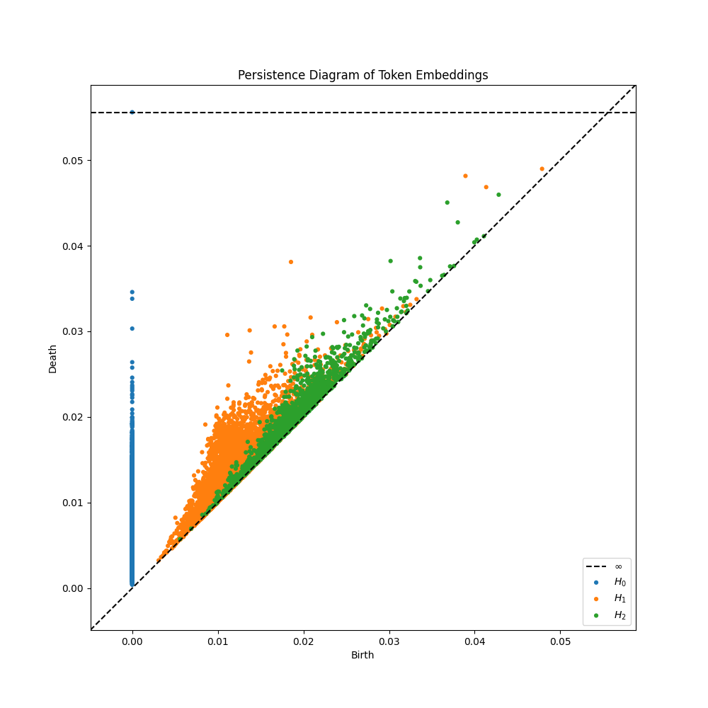

# Topological Analysis of GPT-2 Word Embeddings

This project performs topological data analysis on GPT-2's word embeddings to understand the semantic structure and relationships between tokens in the embedding space.

## Analysis Methods

### 1. Mapper Algorithm Implementation
- Dimensionality reduction using UMAP (n_components=2)
- Cover construction with overlapping hypercubes (n_cubes=40, overlap=0.55)
- Clustering within hypercubes using Agglomerative Clustering
- Visualization of the resulting graph structure

### 2. Persistent Homology
- Dimension reduction to 3D using UMAP
- MaxMin sampling to select representative points
- Computation of persistence diagrams using Ripser
- Analysis of topological features across different distance thresholds
- Caching of sampled points for computational efficiency

Example persistence diagram (threshold = 0.08):

- H₀ (blue): Connected components
- H₁ (orange): Loops/holes
- H₂ (green): Voids/cavities

### 3. Graph Analysis Tools
- Breadth-First Search (BFS) for pathfinding between tokens
- Connected component analysis
- Distance metrics between tokens in the same component
- Random walk functionality for exploring semantic neighborhoods
- Network analysis including:
  - Centrality measures
  - Component size distribution
  - Node connectivity patterns

## Key Findings
- The embedding space shows apparent clustering of semantically related tokens
- Connected components often represent related linguistic concepts
- Bridge nodes frequently represent tokens with multiple semantic contexts
- Topological features suggest a hierarchical organization of language concepts

## Future Work
- Implementation of an AI agent for automated graph analysis
- Enhanced visualization of topological features
- Integration with language understanding tasks
- Comparative analysis with other embedding models

## Files
- `embedding.py`: Main implementation of Mapper algorithm
- `homology.py`: Persistent homology computation
- `graph_structure.py`: Graph analysis tools and utilities
- `token_rag.py`: RAG system for querying token relationships
- `analyze_clusters.py`: Cluster analysis tools
- `token_table.py`: Token lookup and management utilities

## Requirements
- Python 3.8+
- PyTorch
- transformers
- ripser
- persim
- UMAP
- NetworkX
- scikit-learn

## Usage

### 1. Generate Token Graph
```bash
python embedding.py
```
This will:
- Load GPT-2 embeddings
- Perform UMAP dimensionality reduction
- Create Mapper graph structure with 40 hypercubes and 55% overlap
- Save results to `node_clusters_2.json`
- Generate interactive visualization in `mapper_graph_2.html`

### 2. Compute Persistent Homology
```bash
python homology.py
```
This will:
- Load embeddings
- Perform maxmin sampling to select 10000 embeddings (cached in `maxmin_samples.npz`) [this is to improve computation]
- Compute persistence diagrams with radius threshold 0.08 [this will be the what most machines can handle]
- Save results to `persistence_diagrams.png` and `persistence_results.json`

### 3. Analyze Graph Structure
```bash
python graph_structure.py
```
Features:
- Find paths between tokens
- Analyze connected components
- Perform random walks
- Generate network statistics

Example queries:
```python
# Find path between tokens
graph = TokenGraph.from_json("node_clusters_2.json")
path = graph.bfs_path("cube272_cluster9", "cube52_cluster3")
print(graph.get_path_info(path))

# Analyze components
analysis = graph.analyze_components()
print(graph.get_component_info(analysis))

# Random walk from specific node
walk = graph.random_walk("cube52_cluster3", num_steps=5)
print(graph.get_walk_info(walk))
```

### 4. Query Token Relationships
```bash
python token_table.py
```
Provides:
- Token ID lookup
- Token string conversion
- Token relationship exploration
