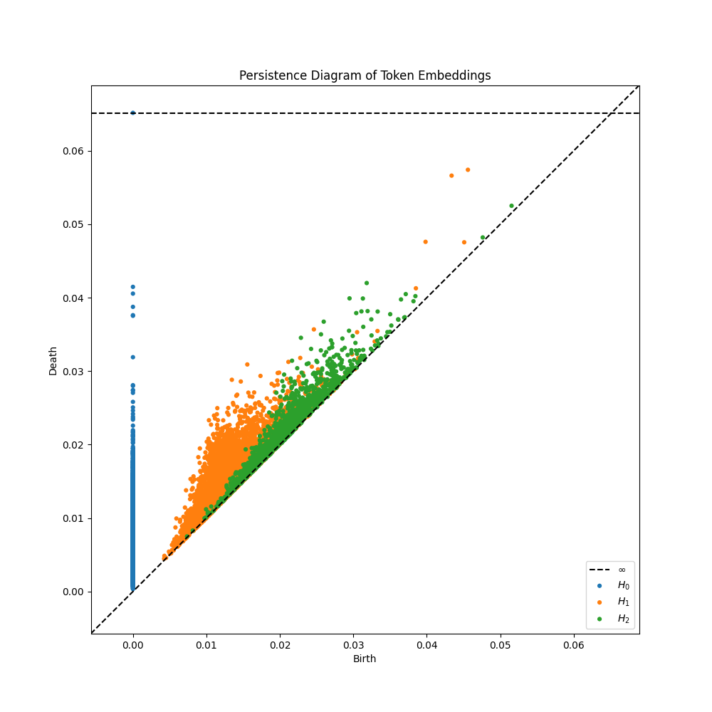

# Embedding Analysis Agent

An AI agent for exploring the semantic structure of GPT-2's token embedding space using Topological Data Analysis (TDA) and natural language queries.

The pipeline maps all 50,257 GPT-2 tokens through the Mapper algorithm to produce a graph of ~9,020 nodes and 36,331 edges. A PydanticAI agent with 16 graph analysis tools runs against this graph, allowing natural language queries about token relationships, semantic communities, and structural biases.

## Quick Start

### Prerequisites
- Python 3.10+
- [Ollama](https://ollama.com) running locally with a tool-capable model

```bash
# Pull a recommended model
ollama pull llama3.1:8b   # or qwen2.5:7b, deepseek-r1:7b

# Install dependencies
python3 -m venv .venv && source .venv/bin/activate
pip install -r requirements.txt

# Run a query
python main.py --query "Find the path between 'king' and 'queen'"

# Interactive mode (graph loaded once, multi-turn conversation)
python main.py --interactive

# Use a different model
python main.py --model qwen2.5:7b --query "Which tokens are most semantically central?"

# Run without Ollama (test mode, no tool calls)
python main.py --query "test" --test-mode
```

### CLI Flags
| Flag | Description | Default |
|---|---|---|
| `--query TEXT` | Single query to run | — |
| `--graph PATH` | Path to graph JSON file | `node_clusters_with_weights.json` |
| `--model NAME` | Ollama model name | `llama3.1:8b` |
| `--interactive` | Start interactive REPL session | — |
| `--test-mode` | Use TestModel instead of Ollama | — |

---

## Analysis Methods

### 1. Mapper Algorithm Implementation
- Dimensionality reduction using UMAP (n_components=2)
- Cover construction with overlapping hypercubes (n_cubes=40, overlap=0.55)
- Clustering within hypercubes using Agglomerative Clustering
- Visualization of the resulting graph structure

### 2. Persistent Homology
- Dimension reduction to 3D using UMAP
- MaxMin sampling to select representative points
- Computation of persistence diagrams using Ripser
- Analysis of topological features across different distance thresholds
- Caching of sampled points for computational efficiency

Example persistence diagram (threshold = 0.08):

- H₀ (blue): Connected components
- H₁ (orange): Loops/holes
- H₂ (green): Voids/cavities

### Interactive Feature Visualization (visualize_samples.py)

The `visualize_samples.py` script provides an interactive 3D visualization dashboard using Plotly Dash:

- **3D Scatter Plot**:
  - Gray points: Base token embeddings
  - Orange points/lines: H1 features (loops/cycles)
  - Green points: H2 features (voids)

- **Interactive Controls**:
  - Persistence threshold slider (0.01 to 0.06)
  - Toggle switches for H1 (Loops) and H2 (Voids) features

- **Feature Details**:
  - Hover information shows actual tokens
  - Birth/death times for topological features
  - Connected lines show loop structures for H1 features
  - ConvexHull visualization for H2 features


### 3. Embedding Analysis Agent

A PydanticAI agent connects to a local Ollama instance and exposes 16 graph analysis tools:

| Tool | Description |
|---|---|
| `find_nodes_with_token` | Locate all graph nodes containing a given token |
| `get_node_info` | Get tokens and connections for a specific node |
| `get_connected_nodes` | List immediate neighbours of a node |
| `get_hypercube_nodes` | List all clusters within a hypercube |
| `bfs_path` | Shortest hop path between two nodes |
| `weighted_bfs_path` | Highest-similarity path between two nodes |
| `find_all_paths` | All paths up to a max depth |
| `analyze_paths` | Explore all paths radiating from a node |
| `random_walk` | Random walk from a starting node |
| `analyze_components` | Connected component structure |
| `detect_communities` | Louvain community detection |
| `compute_node_centrality` | Degree, betweenness, closeness, eigenvector centrality |
| `analyze_network` | Global graph metrics (density, clustering, diameter) |
| `compute_graph_statistics` | Summary statistics |
| `extract_subgraph` | Zoom into a region of interest |
| `analyze_token_patterns` | Token frequency and co-occurrence patterns |

**Example queries:**
```bash
python main.py --query "Find the path between 'king' and 'queen'"
python main.py --query "Which tokens are most semantically central in the graph?"
python main.py --query "Are gender pronouns clustered together?"
python main.py --query "What tokens does node cube0_cluster0 contain?"
```

## Key Findings
- The embedding space shows apparent clustering of semantically related tokens
- Connected components often represent related linguistic concepts
- Bridge nodes frequently represent tokens with multiple semantic contexts
- Topological features suggest a hierarchical organization of language concepts

## Future Work
- TDA pipeline integration: run Mapper + persistent homology from raw embeddings end-to-end
- Enhanced visualization of topological features
- Comparative analysis with other embedding models (GPT-2 large, Llama, etc.)
- Streaming output for long-running agent queries

## Files
| File | Description |
|---|---|
| `main.py` | CLI entry point (`--query`, `--interactive`, `--model`, etc.) |
| `topology_agent.py` | PydanticAI agent wired to Ollama |
| `agent_tools.py` | 16 graph analysis tool functions |
| `system_prompts.py` | Agent system prompt |
| `graph_structure.py` | `TokenGraph` and `Node` data structures |
| `embedding.py` | Mapper algorithm pipeline |
| `homology.py` | Persistent homology computation |
| `node_clusters_with_weights.json` | Precomputed graph (~11 MB) |

## Requirements
- Python 3.10+
- [Ollama](https://ollama.com) with a tool-capable model (`llama3.1:8b`, `qwen2.5:7b`, or `deepseek-r1:7b` recommended)
- See `requirements.txt` for Python dependencies (pydantic-ai, networkx, scikit-learn, umap-learn, transformers, etc.)

## Usage

### 1. Generate Token Graph (optional — precomputed graph included)
```bash
python embedding.py
```
- Loads GPT-2 embeddings, runs UMAP + Mapper
- Outputs `node_clusters_with_weights.json` and `mapper_graph_with_weights.html`

### 2. Compute Persistent Homology (optional)
```bash
python homology.py
```
- MaxMin sampling (10,000 points, cached in `maxmin_samples.npz`)
- Computes persistence diagrams at threshold 0.08
- Outputs `persistence_diagrams.png` and `persistence_results.json`

### 3. Run the Agent
```bash
# Single query
python main.py --query "Find the path between 'man' and 'woman'"

# Interactive REPL (graph loaded once, conversation history maintained)
python main.py --interactive

# Use a specific model or graph file
python main.py --model qwen2.5:7b --graph node_clusters_with_weights.json --interactive
```

### 4. Run Tests
```bash
# Unit tests (no Ollama required)
.venv/bin/python -m pytest tests/

# Integration tests (requires Ollama)
.venv/bin/python -m pytest -m integration
```

## Token Embedding Graph Visualization (mapper_graph_with_weights.html)

Interactive visualization of GPT-2's token embedding space using the Mapper algorithm.


### Graph Statistics
- **Nodes**: 9,020 nodes representing clusters of semantically related tokens
- **Edges**: 36,331 connections between related token clusters
- **Layout**: Force-directed layout showing semantic relationships

### Features
- **Interactive Navigation**: Pan, zoom, and hover over nodes to explore
- **Search Bar**: Search for specific tokens to highlight their locations in the graph
- **Node Information**: 
  - Hover tooltips show node details including:
  - Token content
  - Cluster size
  - Sample tokens from the cluster

### Graph Structure
- Nodes represent clusters of semantically similar tokens
- Edge weights based on positional and semantic similarity
- Connected components show related concept groups
- Denser regions indicate closely related token clusters

### Usage
1. Open mapper_graph_with_weights.html in a web browser
2. Use search bar to find specific tokens
3. Hover over nodes to see token details
4. Pan and zoom to explore different regions
5. Look for patterns in token clustering and connections

The visualization helps understand how GPT-2 organizes its vocabulary in the embedding space and reveals relationships between different concepts and tokens.
